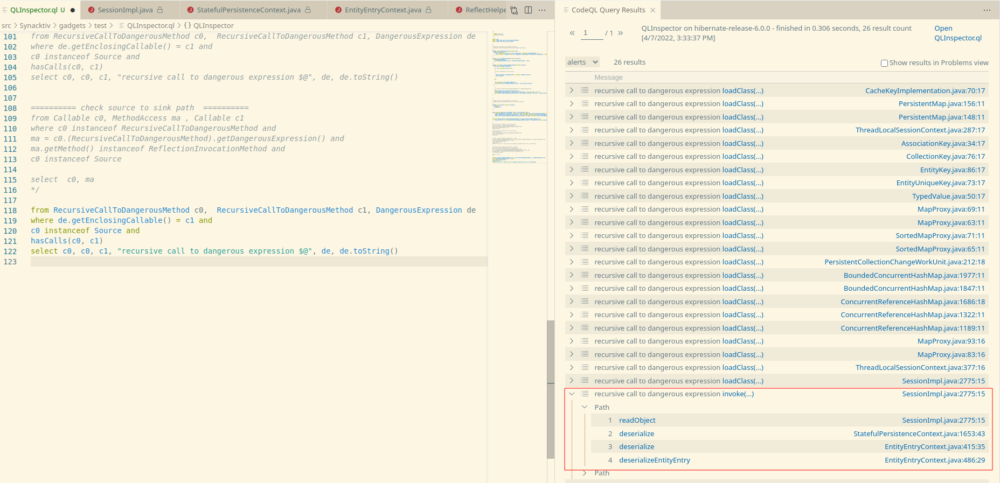

# QLinspector

Finding Java gadget chains with CodeQL.
More information in our [article](https://www.synacktiv.com/publications/finding-gadgets-like-its-2022.html)

## Installation

Move the `QLinspector.ql` file to your codeql source location:
```
mv QLinspector.ql codeql-repo/java/ql/src/your/path/
```

Move the `DangerousMethods.qll` and the `Source.qll` file to the codeql lib folder:
```
mv DangerousMethods.qll codeql-home/codeql-repo/java/ql/lib/semmle/code/java/
mv Source.qll codeql-home/codeql-repo/java/ql/lib/semmle/code/java/security/
```

## Usage

As described in our [article](https://www.synacktiv.com/publications/finding-gadgets-like-its-2022.html) three steps need to be done.

### Finding new sinks

To find new sinks run the following query:

```
from Callable c0,  DangerousExpression de
where c0 instanceof RecursiveCallToDangerousMethod and
de.getEnclosingCallable() = c0
select c0, de
```

### Finding new sources

To find new sources run the following query:

```
from Callable c0
where c0 instanceof RecursiveCallToDangerousMethod and
c0 instanceof Source
select c0
```

Note that both queries can result in a CodeQL error, removing the `@kind path-problem` metadata can fix this issue, however this metadata is required for the next query.

### Linking the sources and the sinks

To link the sources and the sinks the following query can be done thanks to the `edges` predicate:

```
from RecursiveCallToDangerousMethod c0,  RecursiveCallToDangerousMethod c1, DangerousExpression de
where de.getEnclosingCallable() = c1 and
c0 instanceof Source and
hasCalls(c0, c1)
select c0, c0, c1, "recursive call to dangerous expression $@", de, de.toString()
```



### Filtering false positive

Running the above query can return a lot of false positives. To filter them the `Sanitizer` class has been added. You can add conditions to filter out methods. Note that for now it will apply the filter on all the chain. For example if you want to filter the `getValue` method:

```
private class Sanitizer extends Callable {
  Sanitizer(){
    hasName(["getValue"]) 
  }
}
```

### Exploring new ideas

A lot of gadget chains are currently using the call to the `getOutputProperties` method of the `TemplatesImpl` object, new paths can be explored with this query:

```
from Callable c0
where c0 instanceof RecursiveCallToDangerousMethod and
c0.hasNoParameters() and 

c0.getName().matches("get%")

select c0, c0.(RecursiveCallToDangerousMethod).getDangerousExpression()
```

